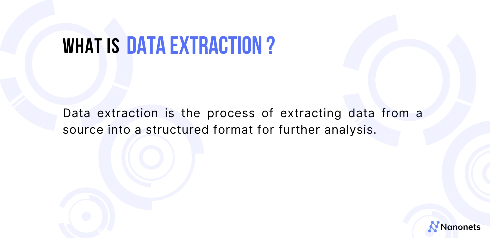
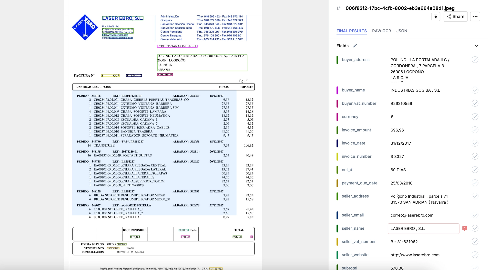
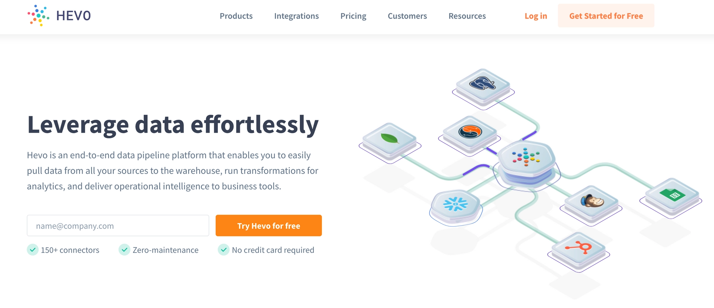
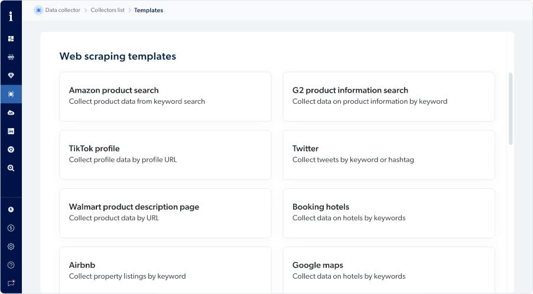
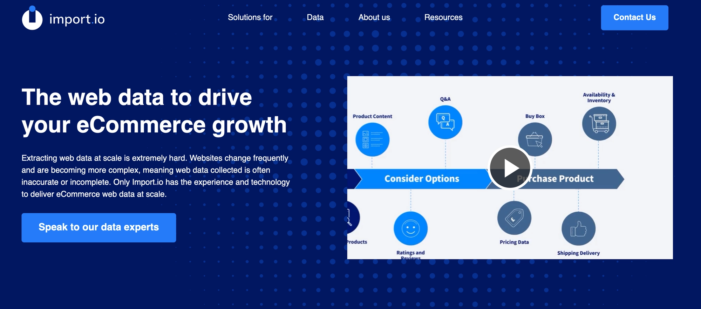
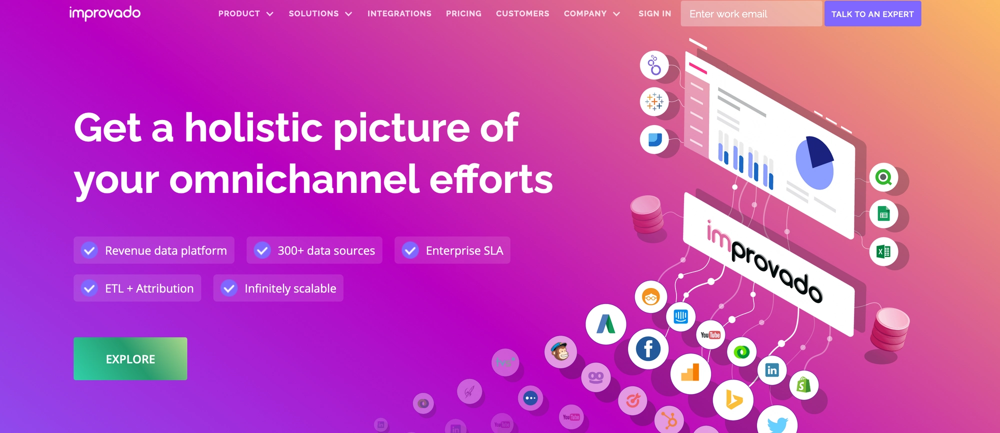
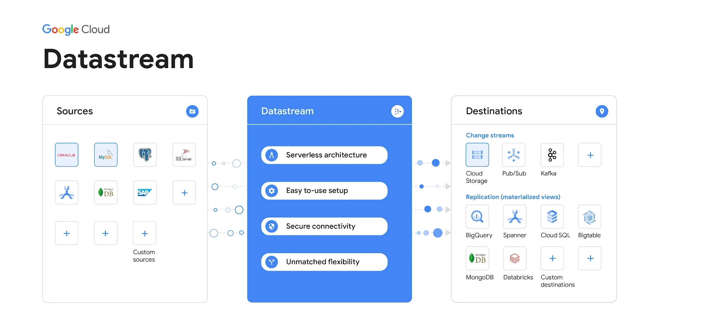
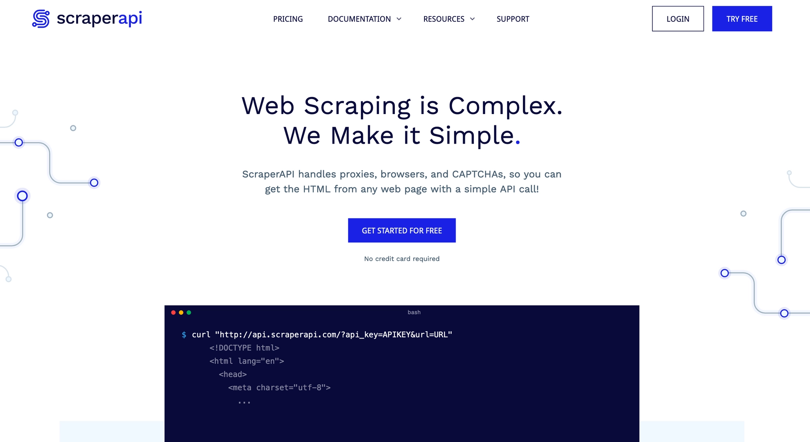
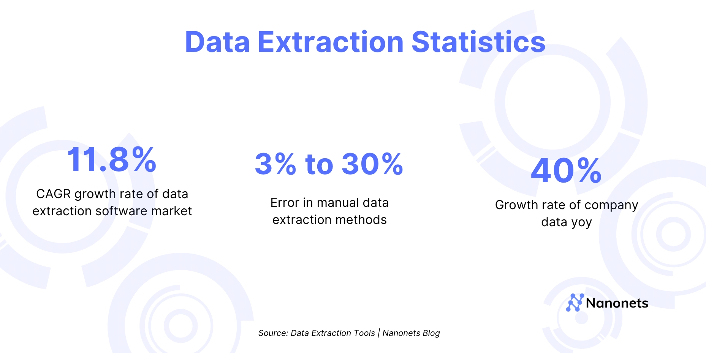

# 2024年十大数据提取工具深度测评

每个公司都有大量数据,但它们藏在PDF文件里、员工的邮件附件中,甚至散落在各种文档系统里。

成功的公司靠数据做决策,这需要靠谱的数据提取和分析工具。本文测评2024年市场上排名前十的数据提取工具,分析它们的优缺点。看完你就能选出最适合自己需求的那一款。

---

## 什么是数据提取?

数据提取就是把原始数据从某个地方拿出来,整理成结构化格式,方便后续分析。所谓"结构化",就是把数据排列成行和列,这样就能轻松导入其他程序或数据库。

这个过程可能包括提取特定信息(比如联系方式、财务数据),也可能是从大数据集中提取部分数据并重新组织,让分析工作更容易进行。

数据提取不只是从网页或邮件里爬信息,还包括处理各种文本文件——Excel表格、Word文档、XML、PDF等等。目标很简单:把原始数据拿出来,然后对它做点什么,比如分析CRM联系人列表,或者用客户的邮箱和地址创建邮件列表。

今天,AI让数据提取变得更准确、更智能。通过在成千上万份文档上训练AI模型,现代数据提取工具能以超过90%的准确率提取所需信息,而且随着处理的文档越来越多,准确率还在不断提升。

数据提取在各行各业都有重要应用,能帮助简化和自动化许多业务流程。从发票数据提取到医疗文档管理,各个团队和企业都能用上。

👉 [想用AI自动提取文档数据?点这里免费试用15分钟搞定](https://www.scraperapi.com/?fp_ref=coupons)

---

## 2024年十大数据提取工具测评

### #1. Nanonets

Nanonets是一款AI驱动的数据提取软件,专为想要自动化文档处理、消除手工任务的企业设计。它采用无代码工作流自动化,能从PDF、文档、图片、邮件、扫描件或非结构化数据集中提取数据,准确率超过95%。

Nanonets的智能文档处理平台能将成本降低50%,处理时间缩短90%。

**优点:**
- 超过500家企业信任Nanonets实时自动化数据提取流程
- 准确率高,超过95%
- 无代码操作,易上手
- 智能文档处理能力强
- 成本和时间节省显著

**缺点:**
- 需要一定的初始设置时间
- 对复杂定制化需求可能需要技术支持

---

### #2. Hevo

Hevo是一款数据提取工具,能帮你从网站提取大量数据。它能捕获和处理任何网站上的所有数据,支持50多种文件格式,可以从网页或音频文件中爬取数据。

界面简单易用,即使不懂编程也能有效使用。

**优点:**
- 能管理大量数据管道
- 自动检测数据源
- 集成方便

**缺点:**
- 数据源越多,定价计划越贵
- 对复杂使用场景有一定限制

---

### #3. Brightdata

Brightdata是一款基于云的数据提取工具,可以从文档、网站和数据库中提取数据。它支持80多种文件格式,包括PDF和Microsoft Word文档。

软件支持多种数据提取方法:可以直接从页面源代码提取信息,也可以解析页面上的表格,还能扫描图片文件并转换为文本。

**免费试用:** 有

**定价:** 永久免费计划。付费计划从每月$500起。

**最适合:** 网络爬虫

**优点:**
- 界面流畅
- 运行时间长
- 代理基础设施庞大
- 客户支持不错

**缺点:**
- 定价偏高
- 需要手动激活账户
- 不适合初学者
- 邮件支持响应慢
- Unblocker工具费用高

---

### #4. Import.io

Import.io是一款可以从网站和社交媒体提取数据的工具,也能处理邮件、文档等。软件有各种功能,比如邮件解析,让用户无需编写代码或使用复杂工具就能获取所需数据。

**优点:**
- 精准有效
- 能爬取网站的特定部分
- 操作简单
- 无需编程

**缺点:**
- 工作流UI比较混乱
- 相比竞品价格偏高
- 需要更多网络爬虫功能
- 必须安装桌面应用
- 软件经常崩溃
- 支持响应慢

---

### #5. Improvado

Improvado提供广泛的数据提取、分析、清理、转换工具和仪表板创建功能。Improvado收入数据平台让企业能够实时了解销售和营销渠道的ROI。

**优点:**
- 整合300多个数据源
- 全周期支持
- 数据收集全面

**缺点:**
- 数据转换功能有待改进
- 定制化选项有限
- 仪表板UI比较混乱
- 复杂流程需要支持团队帮助

---

### #6. DataStream

Datastream是一个数据仓库和管道平台,帮助公司摄取、处理和分析数据。用户可以将来自多个源的数据提取到多个数据库中进行实时分析。还可以使用Datastream的API与其他应用程序集成,比如销售营销工具、CRM系统、ERP系统等。

**优点:**
- 实施简单
- 时间跟踪
- 界面超级直观
- 基于角色的访问控制方便

**缺点:**
- 对一些小企业主来说太贵
- 缺少高级功能
- 对没经验的用户可能有点复杂
- 月费较高

---

### #7. Scraper API

Scraper API是一款网络爬虫工具,让你能快速、准确、高效地从互联网网站提取数据。它的可扩展性和可靠性都很好,所以你可以处理大量信息,不用担心工作流程出现延迟。

Scraper API有直观的界面,即使没有使用过类似工具的人也能轻松上手。

**优点:**
- 代理池大
- 定制选项出色
- 易于使用
- 完全可定制
- 对初学者友好
- 位置支持好

**缺点:**
- 小套餐有限制
- 导航按钮较少
- 对小企业来说价格偏高
- 仪表板小部件可以更互动
- 客服等待时间很长

---

### #8. Tabula

Tabula是一款从PDF中提取表格的数据提取工具。它用Python编写,免费使用。Tabula易于使用,高度可定制,能从PDF中提取表格。

类似于PyPDF2 Python PDF库。

**优点:**
- 高性能
- 易于使用

**缺点:**
- 功能相对有限

---

### #9. Matillion

Matillion是一款自助式数据提取工具。

这个数据提取平台的用户界面很简单,所以你不需要是IT专业人员或熟练的程序员。平台设计灵活,功能会随着你的需求变化而增长。

**优点:**
- 易于使用,界面直观
- 易于监控
- 数据集成和转换
- 设置简单

**缺点:**
- 价格昂贵
- 硬件有硬性限制
- 没有用户社区网站
- 缺少基于角色的访问控制
- 没有备份选项
- 定价高
- 支持响应慢

---

### #10. Levity AI

Levity AI是一款数据提取工具,使用基于云的机器学习和AI从非结构化数据源提取数据。它允许企业从网站、社交媒体、调查、表单等提取数据。该工具有三个模块:网络爬虫模块、交互式表单分析模块和电子邮件爬取模块。

**优点:**
- 集合报告
- 简单的批量订阅管理

**缺点:**
- 设置相当复杂
- 定价高
- 客户支持差
- 与支持团队的沟通需要大量改进
- 产品目录缺少重要功能
- 移动优化界面不存在

---

## 快速推荐总结

看完十款工具,这里是我们的最佳推荐:

- **最适合文档数据提取:** Nanonets
- **最适合电商网络爬虫:** Import.io
- **最适合表格提取:** Nanonets
- **最适合数据统一:** Hevo

最佳数据提取工具是Nanonets。Nanonets有免费版本,每月可提取多达500页,仅供个人使用。该工具准确率接近100%,所以你可以确信所有数据都会被提取出来,没有任何错误或不一致。工具界面易用,支持200多种语言,适合不同背景、不同技术水平的人使用。

---

## 如何选择数据提取工具?

选择数据提取工具时,需要考虑几个因素。以下是一些最重要的考虑点:

- 符合安全标准和法规的程度
- 提取过程中保护敏感数据的能力
- 从源文件保留元数据的能力,包括作者、时间/日期戳和格式
- 与其他应用程序的集成能力,如文档管理系统或ERP系统
- 与各种操作系统的兼容性,如Linux或Mac OS X

---

## 数据提取市场现状

数据提取软件市场预计将以11.8%的年增长率增长,从2019年的21.4亿美元增长到2027年的49亿美元。

企业收集的数据比以往任何时候都多,收集的数据每年增长42%。

现在我们知道有大量数据存在,那如果让数据分析师来做这项工作会怎样?

答案是:数据提取解决方案可以加强数据分析师执行的任务。而且,软件相比手动流程有额外的好处。

采用数据提取的首要原因是自动化那些耗费大量时间的手工任务。超过25%的CEO时间花在手工数据录入任务上,而这些任务可以通过智能自动化平台轻松自动化。

另一个原因是减少数据收集过程中的错误。手动数据提取的错误率高达30%,这会给数据集增加不一致性。

数据提取工具还能提高员工的生产力,因为员工可以专注于更具战略性的任务,而不是繁琐重复的手工任务。

---

## 自动化数据提取 vs 手动数据录入

为什么自动化数据录入比手动数据录入更好?

1. 自动化数据提取可以持续产生高达95%以上的准确率
2. 由于快速处理大量数据,支持更快的客户响应时间
3. 虽然初始投资成本高,但长期回报有保证
4. 由于系统输入的所有数据都会使用先前的模型自动审查和确认,因此无需重新处理
5. 人工智能(AI)和智能机器学习算法自动适应文件格式

因此,自动化数据提取不需要人工交互,处理速度快。

---

## 数据提取的步骤

数据提取是ETL(提取、转换和加载)过程的第一阶段。只有正确提取数据后,你才能转换数据并将其加载到你想用于未来数据分析的目标位置。

简单来说,非结构化数据提取就是从源系统获取数据,以便在数据仓库环境中使用。数据提取过程通常可以分为三个阶段:

1. **识别修改:** 你必须留意数据的任何变化。例如,可能包括新表或新列。
2. **定义要提取的数据:** 你应该决定需要提取数据的哪些部分,然后指定这些部分。
3. **处理数据提取:** 你已经完成了所有必要的步骤,准备使用手动创建的脚本或自动数据提取工具进行数据提取。

---

数据提取正在改变企业处理半结构化或非结构化数据的方式。换句话说,这个过程将半结构化或非结构化数据转换为结构化数据。

由于非结构化和半结构化数据的急剧增加,数据提取变得至关重要。数据提取过程让你的工作更精确,提高销售机会,让你更敏捷。

你必须根据自己的需求使用最佳数据提取软件,才能充分发挥公司数据的潜力。希望我们的文章能帮你做出决定。

👉 [立即开始免费试用,15分钟搞定自动化数据提取](https://www.scraperapi.com/?fp_ref=coupons)
